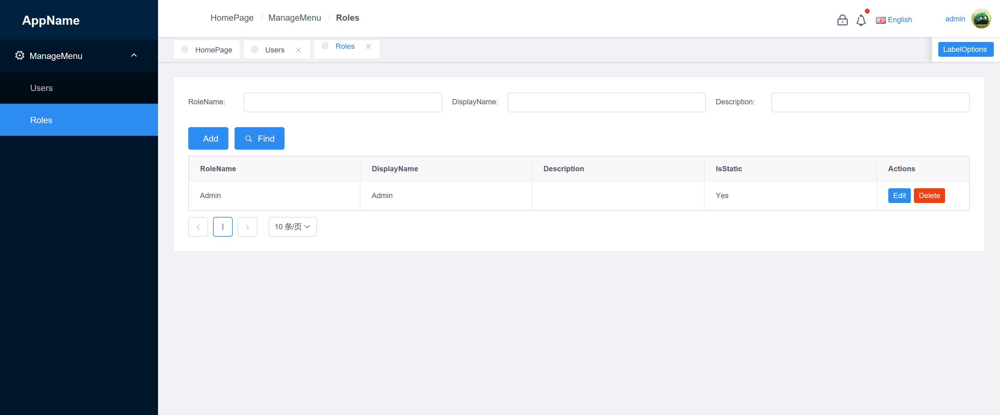

# ASP.NET Boilerplate VueJS Template

The Vue.js integration for ABP Boilerplate framework. This template is built on Vue+iview+Typescript.



## Getting Started

### Installing


Before starting the application, configure the API endpoint when it is not
running on the same machine as the page. Copy `.env.example` to
`.env.development` and set `VUE_APP_REMOTE_SERVICE_BASE_URL` to the reachable
server URL. The API must expose `/api/abp/application-configuration`
(`humanoid-archive-wms`, port 5000 by default).

当前已适配新版后端的应用配置、会话初始化和账号密码登录
（`/api/app/account/login`）。人脸/指静脉、任务统计、出入库以及租户切换等
业务仍有旧版接口调用，尚未完成新版后端适配；页面启动不代表这些业务已可用。

本地仅启动 WMS 时，开发环境默认启用“仅 WMS”模式（`VUE_APP_WMS_ONLY=true`）。
首页只检查已配置的 WMS 是否可访问，不轮询旧任务统计和设备状态接口；设备状态显示
为未接入，任务数量不显示，首页存取档、特征注册及龙门回原点入口不可用。
生产环境需要显式设置该变量才启用；修改环境变量后需重启开发服务或重新构建。
设为 `false` 会恢复原设备联调逻辑，仍需另行完成新版业务接口适配。

```sh
cd vue
yarn install 
```

And then start

```
yarn serve
```

## Deployment

```sh
yarn build
```

## Built With

* [Vue](https://vuejs.org/) - The Progressive JavaScript Framework
* [Typescript](https://www.typescriptlang.org/) - Used for static typing
* [Vuex](https://vuex.vuejs.org/) - Vuex is a state management pattern + library for Vue.js applications. 
* [iView](https://www.iviewui.com/) - A High quality and rich functions, friendly APIs, free and flexible UI Toolkit based on Vue.js.

